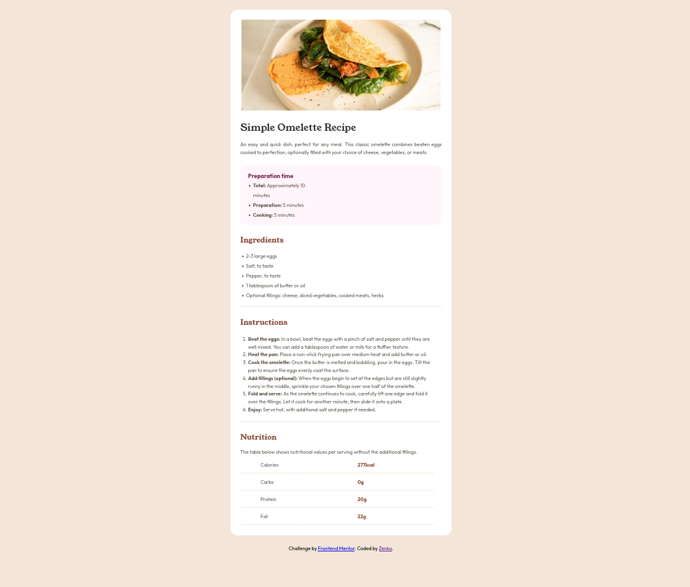
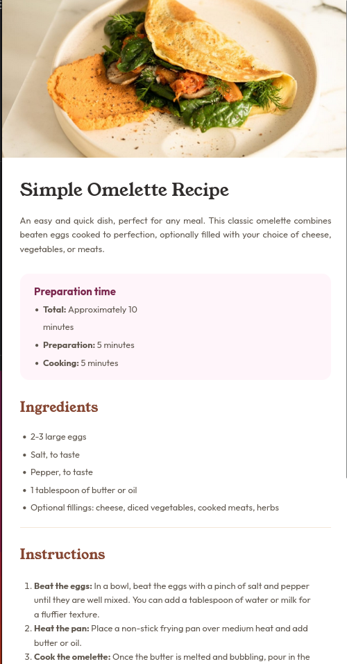

# Frontend Mentor - Recipe page solution

This is a solution to the [Recipe page challenge on Frontend Mentor](https://www.frontendmentor.io/challenges/recipe-page-KiTsR8QQKm). Frontend Mentor challenges help you improve your coding skills by building realistic projects.

## Table of contents

- [Overview](#overview)
  - [The challenge](#the-challenge)
  - [Screenshot](#screenshot)
  - [Links](#links)
- [My process](#my-process)
  - [Built with](#built-with)
  - [What I learned](#what-i-learned)
  - [Continued development](#continued-development)
  - [Useful resources](#useful-resources)
  - [AI Collaboration](#ai-collaboration)
- [Author](#author)
- [Acknowledgments](#acknowledgments)

## Overview

### Screenshot

### Links

- Solution URL: [https://github.com/ZinLinnHtoo-zenko/receipe](https://github.com/ZinLinnHtoo-zenko/receipe)
- Live Site URL: [https://receipe-five.vercel.app/](https://receipe-five.vercel.app/)

## My process

### Built with

- Semantic HTML 5 markup
- Flexbox
- Media Query
- Pseudo classes
- Selector

### What I learned

I learned about brainstorming. Even if I can't think about right away, just relax your mind and concepts you've been learning come out from your mind. It really helps me to keep going.

I also increase my confidence about writing code.

### Continued development

Every time I do the projects, less time I spend on thinking and keep moving forward.

### Useful resources

- [Example resource 1](https://www.google.com) - NGL, google is a treasure for web developer. I can search on it almost anything that I want to know.

### AI Collaboration

We can also use AI apps for helping us not to stuck but not about asking for the solutions. It makes us feel lazy and even make the ideas not to come out freely.

## Author

- Frontend Mentor - [@Zenko](https://www.frontendmentor.io/profile/ZinLinnHtoo-zenko)

## Acknowledgments

Thanks for everyone. Cause I learnt from every resources that I can, for e.g, from uni, youtube videos, friends, etc. It's really fun to learn you know.
